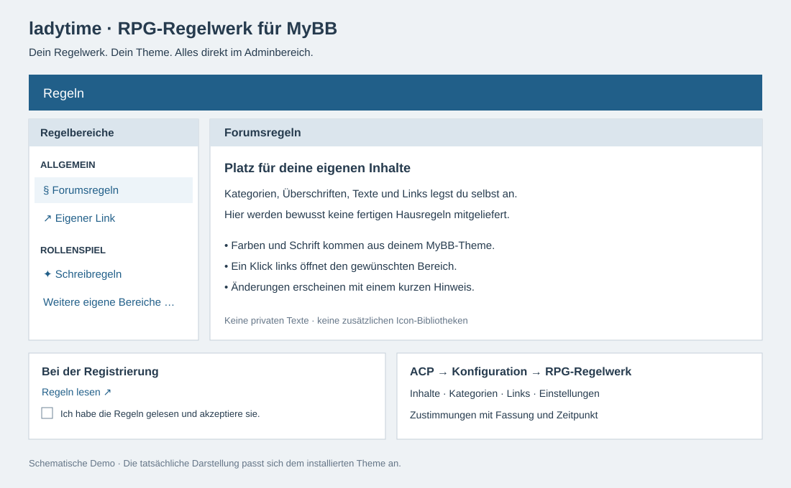

# ladytime – RPG-Regelwerk für MyBB

Eine anpassbare Regelverwaltung für **MyBB 1.8 und Rollenspielforen**. Eigene Kategorien, Texte und Links – ohne vorgegebene Hausregeln oder Inhalte eines bestehenden Forums.

**Version 1.0.0-beta.1 · deutsch · MySQL/MariaDB**



Die Vorschau verwendet ausschließlich Demo-Inhalte. Im Forum übernimmt das Plugin die Farben, Schrift und Tabellenklassen des vorhandenen MyBB-Themes. Kein festes Farbschema, keine externen Schriftarten und keine Icon-Bibliothek erforderlich.

## Was ist enthalten?

- Regelseite mit Kategorien links und dem gewählten Inhalt rechts; auf kleinen Bildschirmen untereinander.
- Beliebig viele Inhaltsbereiche und externe Links. Kategorien entstehen durch ihren frei wählbaren Namen. Titel, Textsymbol, Reihenfolge und Sichtbarkeit sind bearbeitbar.
- Verwaltung direkt im ACP unter **Konfiguration → RPG-Regelwerk**, mit den Reitern Inhalte, Bereich hinzufügen, Einstellungen und Zustimmungen.
- Pflichtzustimmung bei der Registrierung, mit Link zur Regelseite in einem neuen Tab. Ohne Zustimmung wird die Registrierung auch serverseitig abgewiesen.
- Zustimmungsliste ausschließlich für berechtigte Administratoren: Mitglied, Datum und angenommene Fassung. Keine zusätzliche Speicherung von E-Mail-Adresse oder IP-Adresse.
- Versionsprüfung: Ändert das Team einen Regelbereich zwischen Aufruf und Absenden des Registrierungsformulars, muss die aktuelle Fassung erneut bestätigt werden.
- Änderungshinweise auf der Regelseite. Optional erscheint zusätzlich ein kleiner Hinweis auf dem Index, standardmäßig sechs Stunden (einstellbar von 0 bis 168).
- Native MyBB-Klassen wie `tborder`, `thead`, `tcat`, `trow1`, `trow2`, `smalltext`, `checkbox` und `pm_alert`. Nur die zweispaltige Anordnung erhält etwas eigenes CSS.

## Installation

1. Vor einer Installation die eigene Datenbank und Dateien sichern. Die Beta zunächst in einem Testforum ausprobieren.
2. Den Inhalt von **`upload/`** in das MyBB-Hauptverzeichnis kopieren. Bei umbenanntem Adminordner die Datei aus `upload/admin/modules/config/` in **deinen tatsächlichen Adminordner** unter `modules/config/` kopieren.
3. ACP → Konfiguration → Plugins → **ladytime – RPG-Regelwerk für MyBB** installieren und aktivieren.
4. ACP → Konfiguration → **RPG-Regelwerk** öffnen. Die beiden Platzhalter durch die eigenen Texte ersetzen; weitere Kategorien, Bereiche und Links anlegen.
5. Die Seite **`rpg_rules.php`** im gewünschten Forenmenü verlinken. Bestehende Seiten wie `rules.php` werden nicht überschrieben.
6. Als Gast das Registrierungsformular prüfen: Link und Zustimmung müssen sichtbar sein. Registrierung ohne Zustimmung muss scheitern, mit Zustimmung im ACP protokolliert werden.

Alternativ das fertige Paket **[ladytime-rpg-regelwerk-1.0.0-beta.1.zip](ladytime-rpg-regelwerk-1.0.0-beta.1.zip)** herunterladen und entpacken. Nur `upload/` gehört auf den Webserver; Tests und Dokumentation gehören nicht in das Forum.

### Angepasste Themes

Beim Standardtemplate wird die Zustimmung automatisch vor `{$hiddencaptcha}` in `member_register` eingesetzt. Die Template-Datei wird dabei nicht dauerhaft verändert. Wenn ein eigener Style diesen Platzhalter entfernt hat, einmal **`{$ladytime_rules_agreement}`** innerhalb der Registrierungstabelle im Template `member_register` einfügen. Der Platzhalter gibt eine vollständige Tabellenzeile aus.

Der Indexhinweis wird automatisch nach `{$header}` eingefügt. Bei stark angepasstem Index das **`{$ladytime_rules_alert}`**-Feld einmal an geeigneter Stelle im `index`-Template ergänzen. Nicht doppelt einsetzen.

Die Regelseite verwendet das globale Template **`ladytime_rules_page`**. Anpassungen können bei Bedarf als eigene Theme-Templates erfolgen. Es werden keine Standardtemplates überschrieben und keine bestehenden Plugin-Daten migriert.

## Inhalte und Änderungen verwalten

**Bereich hinzufügen** legt ein neues Inhaltsfeld an. Derselbe Kategoriename gruppiert mehrere Einträge. Die Sortiernummern bestimmen die Reihenfolge; Einträge derselben Kategorie nebeneinander anordnen. Ein optionaler Link öffnet eine andere Seite statt eines Regeltextes. `https://` und `http://` sind erlaubt; Skript-URLs werden abgewiesen.

Im Textfeld ist HTML möglich. Beispiel ohne vorgegebenen Regelinhalt:

```html
<h3>Eigene Überschrift</h3>
<p>Hier deinen eigenen Regeltext eintragen.</p>
<ul><li>Eigener Punkt</li><li>Weiterer Punkt</li></ul>
```

Jede gespeicherte Inhaltsänderung erhält eine Fassung und einen kurzen öffentlichen Änderungshinweis. **„Auf Änderung aufmerksam machen“** schaltet zusätzlich den zeitlich begrenzten Indexhinweis ein. Die letzten fünf Änderungen bleiben auf der Regelseite sichtbar. Nicht öffentliche Notizen gehören nicht in das Hinweisfeld, auch wenn der bearbeitete Bereich ausgeblendet ist.

Die Zustimmungsliste hält den Stand bei der Registrierung fest. Bereits vorhandene Mitglieder werden **nicht** rückwirkend als zustimmend markiert. Änderungen erzwingen bei bestehenden Mitgliedern keine neue Zustimmung. Ein kompletter historischer Textstand wird nicht archiviert; für solche Nachweise eigene Sicherungen aufbewahren.

## Berechtigungen und Daten

Die ACP-Berechtigung **„Kann das RPG-Regelwerk und Zustimmungen verwalten?“** steuert den Zugriff. Nur vertrauenswürdigen Administratoren geben: Diese Berechtigung erlaubt bewusst HTML-Inhalte. Die Regelseite selbst ist öffentlich, die Zustimmungsliste nicht.

Das Plugin ändert keine Benutzergruppen, Freischaltungen, Passwortregeln, CAPTCHAs oder sonstigen MyBB-Registrierungseinstellungen. Eine Altersgrenze muss das Team selbst in seinen Texten und im Zustimmungstext festlegen; es gibt keine technische Altersprüfung.

Deaktivieren erhält Daten. **Deinstallieren entfernt die Plugin-Tabellen, Einstellungen und das Plugin-Template einschließlich der Zustimmungsliste.** Für einen Neustart oder eine Pause nur deaktivieren.

## Prüfstand der Beta

Am 02.10.2026 mit PHP 8.4 und dem MyBB-MySQLi-Treiber in einer separaten Testdatenbank geprüft:

- Syntaxprüfung aller PHP-Dateien.
- 21 isolierte Funktionsprüfungen: Installation/Deinstallation, Platzhalter, Pflichtzustimmung, gespeicherte Fassung, veraltete Zustimmung, Hinweisablauf, Linkprüfung und Template-Auswertung.
- Die verwendeten ACP-Formularmethoden und der Registrierungshook wurden mit MyBB 1.8 abgeglichen.

**Noch kein vollständiger Browser-End-to-End-Test in einem frisch installierten MyBB und keine Prüfung sämtlicher Fremdthemes/Plugins.** Deshalb eine Beta, keine Zusicherung universeller Kompatibilität. Das bestehende Forum wurde für diese Veröffentlichung nicht umgebaut.

Die isolierten Tests unter `tests/` benötigen eine eigene, leere Datenbank mit einem Namen `codex_rules_test_*` und den MyBB-Core. Sie dürfen nicht gegen eine Forumsdatenbank ausgeführt werden. `MYBB_CORE`, `RULES_TEST_DB`, optional `RULES_TEST_USER` und `RULES_TEST_PASSWORD` als Umgebungsvariablen setzen und `php tests/smoke.php` aufrufen. Die Tests simulieren Teile des MyBB-Lebenszyklus; sie ersetzen keinen Browser-Test.

## Rückmeldungen

Für Fehler bitte ein GitHub-Issue mit MyBB-/PHP-Version, Theme, erwarteter Funktion und Fehlermeldung eröffnen. **Keine Passwörter, privaten Regeltexte, Datenbankexporte oder echten Zustimmungsliste-Daten veröffentlichen.**

Erstellt für Rollenspielforen von **ladytime**, mit technischer KI-Unterstützung. Dieses Paket enthält keine privaten Forumsinhalte. Eine gesonderte Nutzungslizenz ist in dieser ersten Veröffentlichung noch nicht festgelegt.
